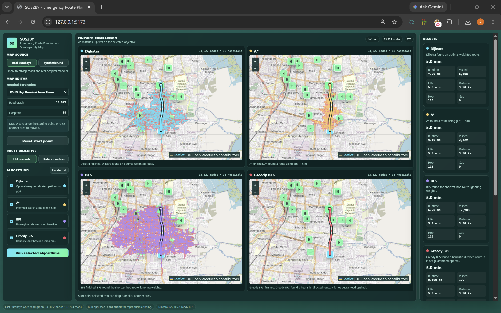
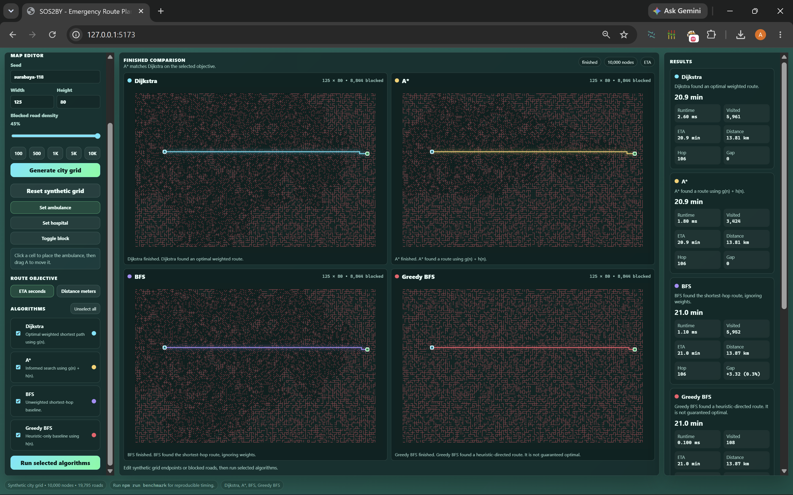

<div align="center">

# SOS2BY

### Emergency Route Planning on Surabaya City Map using Dijkstra, A*, BFS, and Greedy Best-First Search

**EF234405 Design and Analysis of Algorithms - Final Exam Group Capstone Project**

SOS2BY models emergency route planning as a weighted graph problem.  
The application compares exact weighted search, informed search, unweighted baseline search, and heuristic-only search on the same routing instances.

</div>

---

## Team

| NRP | Name | Class |
| :---: | --- | :---: |
| 5025231027 | Naufal Dariskarim | DAA E |
| 5025231187 | Dapunta Adyapaksi Ratyanasja | DAA D |

---

## Repository

|  |  |
| --- | --- |
| Source Code | [GitHub](https://github.com/Gluttony6547/Emergency-Hospital-Routing) |
| Demo (Maintained) | [sos2by.dapuntaratya.com](https://sos2by.dapuntaratya.com/) |
| Demo (Alternative) | [103.30.195.224:50505](https://103.30.195.224:50505) |
|  |  |

---

## Preview





---

## Table of Contents

1. [Project Overview](#1-project-overview)
2. [Problem Statement and Motivation](#2-problem-statement-and-motivation)
3. [Formal Computational Model](#3-formal-computational-model)
4. [Algorithm Selection and Justification](#4-algorithm-selection-and-justification)
5. [Data Structures and Architecture](#5-data-structures-and-architecture)
6. [Application Features](#6-application-features)
7. [Repository Structure](#7-repository-structure)
8. [Build and Run Instructions](#8-build-and-run-instructions)
9. [Benchmark and Reproducibility](#9-benchmark-and-reproducibility)
10. [Correctness Justification](#10-correctness-justification)
11. [Complexity Analysis](#11-complexity-analysis)
12. [Empirical Evaluation](#12-empirical-evaluation)
13. [Configuration](#13-configuration)
14. [Screenshots](#14-screenshots)
15. [Limitations and Future Work](#15-limitations-and-future-work)
16. [Attribution and External Resources](#16-attribution-and-external-resources)
17. [Final Requirement Checklist](#17-final-requirement-checklist)

---

## 1. Project Overview

SOS2BY is a static web application for emergency route planning in Surabaya. The application receives an ambulance starting point and a hospital destination, then computes and visualizes route alternatives using four graph-search algorithms:

1. Dijkstra
2. A*
3. Breadth-First Search (BFS)
4. Greedy Best-First Search (Greedy BFS)

The application supports two graph sources:

| Source | Purpose |
|---|---|
| Real Surabaya map | Demonstrates the problem on a real road network and real hospital markers. |
| Synthetic grid | Provides controlled input sizes for benchmarking and reproducible empirical analysis. |

The implementation uses:

- HTML
- CSS
- Vanilla JavaScript ES modules
- Leaflet for real map rendering only
- Node.js scripts for benchmark generation only

The implementation does not use:

- React
- Vue
- Angular
- Backend framework
- Database
- Shortest-path library
- Build step

The core algorithmic logic is implemented directly in this repository.

---

## 2. Problem Statement and Motivation

Emergency routing requires selecting a route from an ambulance location to a hospital destination. In practice, a route should not only exist, it should also be efficient according to a measurable objective such as estimated travel time or physical distance.

The problem matters because emergency response time affects the ability to reach patients or hospitals quickly. A route planner can be used by ambulance dispatchers, hospital routing simulations, or educational pathfinding demos to compare how different algorithms behave on the same road graph.

This project focuses on the algorithmic part of the problem:

```text
Given a graph, a start node, a destination node, and an objective weight,
find and compare paths produced by several graph-search algorithms.
```

The application provides an interactive demo, while the benchmark script measures the algorithmic behavior on controlled graph sizes.

---

## 3. Formal Computational Model

### 3.1 Graph Definition

The routing problem is modeled as a graph:

```text
G = (V, E)
```

Where:

| Symbol | Meaning |
|---|---|
| `V` | Set of vertices. A vertex represents a road node in the real map or a grid node in the synthetic graph. |
| `E` | Set of edges. An edge represents a valid road segment or a valid grid movement between two adjacent nodes. |
| `w(e)` | Edge weight used by the selected objective. |
| `s ∈ V` | Source node, representing the ambulance starting location. |
| `t ∈ V` | Target node, representing the selected hospital destination. |
| `P` | A path from `s` to `t`, represented as an ordered sequence of nodes. |

### 3.2 Edge Weights

Each edge stores two weights:

```text
distanceMeters(e)
etaSeconds(e)
```

The application supports two objective modes:

| Objective Mode | Weight Function | Interpretation |
|---|---|---|
| ETA seconds | `w(e) = etaSeconds(e)` | Minimize estimated travel time. |
| Distance meters | `w(e) = distanceMeters(e)` | Minimize physical route distance. |

The default objective is **ETA seconds** because emergency routing is naturally time-sensitive. Distance mode is also available because it is easier to inspect as a pure shortest-distance graph problem.

### 3.3 Input

The input consists of:

1. A graph source:
   - real Surabaya road graph, or
   - synthetic generated grid graph.
2. A source node `s`.
3. A target node `t`.
4. An objective mode:
   - ETA seconds, or
   - distance meters.
5. A selected set of algorithms.

### 3.4 Output

For each selected algorithm, the output is:

| Output Field | Meaning |
|---|---|
| `found` | Whether a route from `s` to `t` exists. |
| `path` | Ordered node sequence from `s` to `t`. |
| `hopCount` | Number of edges in the produced path. |
| `totalDistanceMeters` | Sum of distance weights along the path. |
| `totalEtaSeconds` | Sum of ETA weights along the path. |
| `objectiveCost` | Sum of selected objective weight along the path. |
| `visitedCount` | Number of nodes explored by the algorithm. |
| `runtimeMs` | Pure algorithm runtime, excluding animation time. |
| `gapVsDijkstra` | Difference from Dijkstra's objective cost. |
| `gapPercentVsDijkstra` | Percentage gap from Dijkstra's objective cost. |

### 3.5 Objective

For weighted algorithms, the main objective is:

```text
Find path P = <s = v0, v1, ..., vk = t>
that minimizes:
Σ w(vi, vi+1), for i = 0 to k - 1
```

Dijkstra is used as the exact weighted baseline for this objective. A* is expected to match Dijkstra when the heuristic is admissible and consistent. BFS and Greedy BFS are baseline algorithms used to show quality-versus-speed trade-offs.

### 3.6 Constraints

The model uses the following constraints:

- Edge weights are non-negative.
- The graph is represented by adjacency lists.
- The benchmark uses synthetic graphs with at least `n ≥ 1,000` in the required scale.
- The benchmark sweep uses five input sizes from `100` to `10,000` nodes.
- The benchmark seed is fixed for reproducibility.
- The core algorithms are implemented manually without calling a library shortest-path function.

---

## 4. Algorithm Selection and Justification

The project implements four algorithms.

| Algorithm | Priority Rule | Data Structure | Role | Weighted Optimal? |
|---|---|---|---|---|
| Dijkstra | `g(n)` | Custom binary min-heap | Main exact weighted shortest-path algorithm | Yes |
| A* | `g(n) + h(n)` | Custom binary min-heap | Informed weighted search | Yes, if `h(n)` is admissible and consistent |
| BFS | `depth(n)` | Queue | Simple unweighted baseline | No |
| Greedy BFS | `h(n)` | Custom binary min-heap | Heuristic-only baseline | No |

### 4.1 Dijkstra

Dijkstra is selected because the routing graph has non-negative edge weights. It gives the optimal route for the selected objective, either ETA or distance.

Role in this project:

```text
Exact weighted shortest-path baseline.
```

### 4.2 A*

A* is selected because it uses a heuristic to guide search toward the target. It is still optimal when the heuristic is a valid lower bound.

Role in this project:

```text
Exact informed search that should match Dijkstra while exploring fewer nodes in many cases.
```

### 4.3 BFS

BFS is selected as a simple baseline. It ignores edge weights and minimizes hop count instead of ETA or distance.

Role in this project:

```text
Unweighted shortest-hop baseline.
```

BFS is not expected to always match Dijkstra. When BFS returns a route with larger ETA or distance, the difference is reported as a quality gap.

### 4.4 Greedy Best-First Search

Greedy BFS is selected as a heuristic-only baseline. It always expands the node that appears closest to the target according to `h(n)`, without considering the accumulated cost `g(n)`.

Role in this project:

```text
Fast heuristic baseline that may visit fewer nodes but is not guaranteed to produce an optimal route.
```

This algorithm creates a clear comparison against A*:

```text
A*         : priority = g(n) + h(n)
Greedy BFS : priority = h(n)
```

The difference shows why using only the heuristic can be faster but less reliable.

---

## 5. Data Structures and Architecture

### 5.1 Main Data Structures

| Data Structure | Used In | Reason |
|---|---|---|
| Adjacency list | Graph representation | Efficient graph traversal; space `O(V + E)`. |
| Custom binary min-heap | Dijkstra, A*, Greedy BFS | Efficient priority queue operations. |
| Queue array with index pointer | BFS | Efficient FIFO traversal without expensive `shift()`. |
| Maps / objects | Node lookup, distance table, predecessor table | Fast access by node ID. |
| Canvas | Synthetic grid viewer | Efficient rendering for up to 10,000 nodes and multiple viewers. |
| Leaflet layers | Real Surabaya viewer | Efficient real map tile, marker, and polyline rendering. |

### 5.2 High-Level Architecture

```text
index.html
   |
   v
js/main.js
   |
   v
App Controller
   |
   +-- App State
   |
   +-- DOM Binder
   |
   +-- Graph Source
   |      |
   |      +-- Real Surabaya Graph
   |      +-- Synthetic Grid Graph
   |
   +-- Algorithm Registry
   |      |
   |      +-- Dijkstra
   |      +-- A*
   |      +-- BFS
   |      +-- Greedy BFS
   |
   +-- Viewer Manager
   |      |
   |      +-- Real Map Viewer
   |      +-- Synthetic Grid Viewer
   |      +-- Animation Runner
   |
   +-- Results Panel
          |
          +-- Metrics
          +-- Comparison Table
          +-- Benchmark Preview
```

### 5.3 Runtime State Machine

The application uses three execution states:

```text
prepared -> running -> finished
```

| State | Behavior |
|---|---|
| `prepared` | One editable viewer is shown. Start point, hospital, synthetic obstacles, and objective can be changed. |
| `running` | The selected algorithms run on a snapshot of the current graph. Editing is disabled. One viewer is created per selected algorithm. |
| `finished` | Final paths, explored areas, metrics, and comparisons remain visible. The map can be edited again or the run can be repeated. |

### 5.4 Algorithm Registry

Algorithms are registered in:

```text
js/algorithms/registry.js
```

The UI reads the registry and builds the algorithm selector automatically. Adding a new algorithm requires:

1. Create a new algorithm file in `js/algorithms/`.
2. Export a function with the same result format.
3. Register the algorithm in `registry.js`.

The controller does not hard-code each algorithm button.

### 5.5 Separation of Responsibilities

| Module Group | Responsibility |
|---|---|
| `js/app/` | Application state, controller, DOM references, global config. |
| `js/graph/` | Graph construction, graph utilities, priority queue. |
| `js/algorithms/` | Pure algorithm implementations. No DOM access. |
| `js/viewers/` | Visual display and animation for real map and synthetic grid. |
| `js/results/` | Metrics, summary cards, and comparison table. |
| `js/utils/` | Formatting, geometry, seeded random, CSV helpers. |
| `scripts/` | Node.js benchmark and plot generation. |
| `benchmarks/` | Generated benchmark CSV, JSON, and runtime plot. |

---

## 6. Application Features

### 6.1 Map Source

The application provides two map sources:

| Map Source | Description |
|---|---|
| Real Surabaya | Uses a static Surabaya road graph and hospital markers. |
| Synthetic Grid | Generates a controlled grid graph using seed, size, and blocked-road density. |

### 6.2 Real Surabaya Mode

Real Surabaya mode includes:

- hospital destination selector
- 18 hospital markers
- road graph with 33,822 nodes and 37,763 roads
- click-to-place ambulance start point
- draggable start marker `A`
- reset start point button
- animated explored area
- final route overlay
- algorithm comparison over the same selected start and target

The real map uses Leaflet only for visual rendering. The route computation uses the internal graph and custom algorithm modules.

### 6.3 Synthetic Grid Mode

Synthetic grid mode includes:

- seed input
- width and height input
- blocked-road density slider
- size presets:
  - `100`
  - `500`
  - `1K`
  - `5K`
  - `10K`
- generate city grid button
- reset synthetic grid button
- set ambulance tool
- set hospital tool
- toggle blocked-road tool
- random or fixed start/end configuration
- detailed canvas animation

Synthetic grid is used for benchmark because its input size can be controlled exactly.

### 6.4 Algorithm Comparison

The algorithm selector supports:

- select/unselect per algorithm
- select all / unselect all
- one run button for the selected algorithm set

During running state:

```text
number of viewers = number of selected algorithms
```

Example:

| Selected Algorithms | Viewer Count |
|---|---:|
| Dijkstra only | 1 |
| Dijkstra + A* | 2 |
| Dijkstra + A* + BFS | 3 |
| Dijkstra + A* + BFS + Greedy BFS | 4 |

Each viewer shows the route and algorithm-specific exploration.

### 6.5 Results Panel

The results panel shows:

- route status
- runtime
- visited nodes
- ETA
- distance
- hop count
- gap vs Dijkstra
- per-algorithm cards
- comparison table
- benchmark preview

---

## 7. Repository Structure

```text
sos2by/
├── index.html
├── README.md
├── package.json
├── package-lock.json
├── .gitignore
│
├── css/
│   └── style.css
│
├── data/
│   └── surabaya-real-map.js
│
├── js/
│   ├── main.js
│   │
│   ├── app/
│   │   ├── app-controller.js
│   │   ├── app-state.js
│   │   ├── config.js
│   │   ├── constants.js
│   │   └── dom.js
│   │
│   ├── algorithms/
│   │   ├── astar.js
│   │   ├── bfs.js
│   │   ├── dijkstra.js
│   │   ├── greedy-bfs.js
│   │   ├── registry.js
│   │   └── search-result.js
│   │
│   ├── graph/
│   │   ├── graph-utils.js
│   │   ├── priority-queue.js
│   │   ├── real-surabaya-graph.js
│   │   └── synthetic-grid-graph.js
│   │
│   ├── results/
│   │   ├── metrics.js
│   │   └── results-panel.js
│   │
│   ├── utils/
│   │   ├── csv.js
│   │   ├── format.js
│   │   ├── geometry.js
│   │   └── random.js
│   │
│   └── viewers/
│       ├── animation-runner.js
│       ├── real-map-viewer.js
│       ├── synthetic-grid-viewer.js
│       └── viewer-manager.js
│
├── scripts/
│   ├── benchmark.js
│   └── generate-plot.js
│
├── benchmarks/
│   ├── benchmark-results.csv
│   ├── benchmark-results.json
│   └── runtime-plot.svg
│
├── docs/
│   ├── architecture.md
│   ├── architecture.txt
│   ├── benchmark-method.md
│   └── structure.txt
│
└── screenshot/
    ├── real_surabaya.png
    └── synthetic_grid.png
```

---

## 8. Build and Run Instructions

### 8.1 Requirements

Recommended runtime:

```text
Node.js 18 or newer
npm
Modern browser with ES module support
```

The application is static. Node.js is used only to serve local files and run benchmark scripts.

### 8.2 Install Dependencies

```bash
npm install
```

### 8.3 Run the Application

```bash
npm run dev
```

Open:

```text
http://localhost:5173
```

### 8.4 Run Without npm Script

If a simple static server is preferred:

```bash
python -m http.server 5173
```

Open:

```text
http://localhost:5173
```

This alternative may work for the app, but the benchmark and plot scripts still require Node.js.

### 8.5 Regenerate Benchmark

```bash
npm run benchmark
```

### 8.6 Regenerate Runtime Plot

```bash
npm run plot
```

### 8.7 Regenerate Both Benchmark and Plot

```bash
npm run check
```

### 8.8 Expected Output Files

After running the benchmark and plot scripts, these files are generated or updated:

```text
benchmarks/benchmark-results.csv
benchmarks/benchmark-results.json
benchmarks/runtime-plot.svg
```

---

## 9. Benchmark and Reproducibility

### 9.1 Benchmark Purpose

The benchmark measures the core algorithms without UI animation. This separation is important because animation time depends on browser rendering, while algorithm runtime should measure only the search procedure.

### 9.2 Benchmark Source

The benchmark uses synthetic graphs instead of the real Surabaya graph because synthetic graphs provide controlled input sizes and reproducible graph generation.

The real map is still used in the end-to-end demo to show the real-world routing scenario.

### 9.3 Benchmark Seed

The benchmark uses a fixed seed:

```text
exam-2026
```

### 9.4 Benchmark Sizes

The benchmark uses five input sizes:

| Size Label | Nodes |
|---|---:|
| `10x10` | 100 |
| `25x20` | 500 |
| `40x25` | 1,000 |
| `100x50` | 5,000 |
| `125x80` | 10,000 |

This satisfies the required sweep from `100` to `10,000` nodes.

### 9.5 Benchmark Matrix

The benchmark is designed to cover:

```text
5 graph sizes × 2 objective modes × 4 algorithms
```

Objective modes:

1. ETA seconds
2. Distance meters

Algorithms:

1. Dijkstra
2. A*
3. BFS
4. Greedy BFS

### 9.6 Benchmark Fields

The benchmark output stores:

| Field | Meaning |
|---|---|
| `seed` | Fixed generation seed. |
| `objective` | ETA or distance mode. |
| `sizeLabel` | Human-readable graph size. |
| `nodes` | Number of nodes. |
| `roads` | Number of road/edge candidates. |
| `blockedRoads` | Number of blocked roads. |
| `blockedDensity` | Blocked-road density used by generator. |
| `algorithmId` | Algorithm identifier. |
| `found` | Whether route exists. |
| `runtimeMs` | Algorithm runtime in milliseconds. |
| `visitedCount` | Number of explored nodes. |
| `hopCount` | Number of route edges. |
| `totalDistanceMeters` | Total path distance. |
| `totalEtaSeconds` | Total estimated travel time. |
| `objectiveCost` | Cost according to selected objective. |
| `gapVsDijkstra` | Difference from Dijkstra's cost. |
| `gapPercentVsDijkstra` | Percentage difference from Dijkstra's cost. |
| `aStarMatchesDijkstra` | Cross-check flag for A* and Dijkstra. |

### 9.7 Reproducibility Command

The one-command benchmark entry point is:

```bash
npm run check
```

This command regenerates benchmark timing data and the runtime plot.

---

## 10. Correctness Justification

### 10.1 Dijkstra Correctness

Dijkstra is correct for graphs with non-negative edge weights.

The implementation maintains:

- `dist[v]`: best known distance from source `s` to node `v`;
- `previous[v]`: predecessor used to reconstruct the path;
- min-heap priority by `dist[v]`.

Loop invariant:

```text
When a node u is removed from the min-heap and settled,
dist[u] is the shortest possible distance from s to u.
```

Reason:

1. The heap always extracts the unsettled node with the smallest known distance.
2. All edge weights are non-negative.
3. Any alternative path to the extracted node through an unsettled node cannot become smaller later, because it would add a non-negative edge weight.
4. Therefore, once a node is settled, its distance is final.
5. When the target is settled, the reconstructed path is the minimum-cost path from `s` to `t`.

This proves Dijkstra gives the optimal route for the selected objective.

### 10.2 A* Correctness

A* uses:

```text
f(n) = g(n) + h(n)
```

Where:

- `g(n)` is the accumulated cost from source to `n`;
- `h(n)` is a lower-bound estimate from `n` to target.

Heuristic policy:

| Mode | Heuristic |
|---|---|
| Distance mode, real map | Straight-line distance to target. |
| ETA mode, real map | Straight-line distance divided by maximum possible speed. |
| Distance mode, synthetic grid | Manhattan distance multiplied by minimum distance per step. |
| ETA mode, synthetic grid | Manhattan distance multiplied by minimum ETA per step. |

The heuristic is designed as a lower bound, so it does not overestimate the remaining route cost. Under this condition, A* is admissible. The graph movement model also makes the heuristic consistent because moving through one edge cannot reduce the lower-bound estimate by more than the edge cost.

Therefore:

```text
A* returns the same optimal objective cost as Dijkstra.
```

The benchmark includes a cross-check field `aStarMatchesDijkstra` to verify this behavior empirically.

### 10.3 BFS Correctness for Unweighted Hop Count

BFS explores the graph level by level.

Invariant:

```text
When BFS first discovers a node v, it has found a path with the minimum number of edges from s to v.
```

Reason:

1. BFS starts at level 0 from `s`.
2. All nodes one edge away are discovered before nodes two edges away.
3. All nodes at depth `k` are processed before nodes at depth `k + 1`.
4. Therefore, the first discovery of a node gives the smallest hop count.

BFS is correct for shortest-hop routing, but it does not optimize ETA or distance when edges have different weights.

### 10.4 Greedy BFS Correctness Scope

Greedy BFS uses:

```text
priority(n) = h(n)
```

It expands the node that appears closest to the target according to the heuristic. This approach can quickly find a route, but it ignores accumulated path cost `g(n)`.

Therefore:

```text
Greedy BFS is correct as a reachability/path-finding heuristic,
but it is not guaranteed to produce an optimal weighted route.
```

Its result is compared against Dijkstra through `gapVsDijkstra`.

---

## 11. Complexity Analysis

Let:

```text
V = number of nodes
E = number of edges
```

### 11.1 Time Complexity

| Algorithm | Worst-Case Time | Explanation |
|---|---:|---|
| Dijkstra | `O((V + E) log V)` | Each heap operation costs `O(log V)`; edges are relaxed through adjacency lists. |
| A* | `O((V + E) log V)` | Same worst-case bound as Dijkstra; heuristic can reduce practical exploration. |
| BFS | `O(V + E)` | Each vertex and adjacency list is processed at most once. |
| Greedy BFS | `O((V + E) log V)` | Uses a priority queue ordered by heuristic. Worst case can still explore many nodes. |

### 11.2 Space Complexity

| Algorithm | Space |
|---|---:|
| Dijkstra | `O(V + E)` |
| A* | `O(V + E)` |
| BFS | `O(V + E)` |
| Greedy BFS | `O(V + E)` |

The graph itself uses adjacency lists, so graph storage is `O(V + E)`. Algorithm auxiliary structures such as distance tables, visited sets, predecessor tables, queues, and heaps use `O(V)` additional memory.

### 11.3 Comparative Analysis

| Comparison | Expected Behavior |
|---|---|
| Dijkstra vs A* | Both should produce the same optimal cost. A* may visit fewer nodes when the heuristic is informative. |
| Dijkstra vs BFS | BFS can be faster, but it minimizes hop count instead of weighted ETA/distance. |
| Dijkstra vs Greedy BFS | Greedy BFS can visit very few nodes, but it can return a worse route. |
| A* vs Greedy BFS | A* uses both accumulated cost and heuristic; Greedy BFS uses only heuristic. |

---

## 12. Empirical Evaluation

### 12.1 Experimental Setup

The empirical benchmark is generated by:

```bash
npm run check
```

The script:

1. generates synthetic graph instances using fixed seed `exam-2026`
2. runs every selected algorithm on the same instances
3. measures pure algorithm runtime
4. writes CSV and JSON benchmark output
5. generates `benchmarks/runtime-plot.svg`

Timing is machine-dependent, so the checked-in benchmark files are sample results. The command above should be used to regenerate timings on a clean checkout.

### 12.2 Benchmark Scale

The benchmark includes the required non-trivial scale:

```text
n = 1,000
n = 5,000
n = 10,000
```

It also includes smaller sizes for trend observation:

```text
n = 100
n = 500
```

### 12.3 Result Interpretation

The benchmark uses Dijkstra as the weighted optimal baseline.

Expected cross-checks:

| Check | Expected Result |
|---|---|
| A* objective cost vs Dijkstra | Should match. |
| BFS objective cost vs Dijkstra | May match or may have positive gap. |
| Greedy BFS objective cost vs Dijkstra | May match or may have positive gap. |
| All algorithms route found | Expected when generated graph is connected between selected endpoints. |

### 12.4 Theory vs Practice

Theoretical complexity gives the worst-case growth. Measured runtime can differ because:

- the generated graph may not force worst-case exploration;
- A* and Greedy BFS may terminate early if the target is reached quickly;
- JavaScript runtime and browser/Node.js engine optimizations affect small timings;
- synthetic start and target positions influence how much of the graph is explored.

Even with these factors, the expected trend remains:

- BFS has linear graph traversal complexity.
- Dijkstra and A* have heap-based logarithmic factors.
- A* can reduce visited nodes compared with Dijkstra.
- Greedy BFS can be very fast but has no weighted optimality guarantee.

### 12.5 Runtime Plot

The benchmark plot is stored in:

```text
benchmarks/runtime-plot.svg
```


It visualizes runtime growth across benchmark sizes.

---

## 13. Configuration

Global configuration is stored in:

```text
js/app/config.js
```

### 13.1 Animation Configuration

```js
animation: {
  nodeVisitDelaySeconds: 0.03,
  real: {
    targetFrames: 96,
    maxVisitedEdges: 50000,
    maxVisitedPoints: 5000,
    keepVisitedAfterFinish: true,
  },
  synthetic: {
    targetFramesByScale: {
      small: 84,
      medium: 58,
      large: 42,
      huge: 34,
    },
  },
}
```

Main configurable behavior:

| Config | Meaning |
|---|---|
| `nodeVisitDelaySeconds` | Delay used to make exploration animation visible. |
| `real.targetFrames` | Target animation frames for real map visualization. |
| `real.maxVisitedEdges` | Maximum explored edges drawn on real map. |
| `real.maxVisitedPoints` | Maximum explored points drawn on real map. |
| `real.keepVisitedAfterFinish` | Keeps explored area visible after route is found. |
| `synthetic.targetFramesByScale` | Controls animation chunking for different graph sizes. |

### 13.2 Color Configuration

```js
colors: {
  algorithms: {
    dijkstra: '#30e7ff',
    astar: '#ffd166',
    bfs: '#a78bfa',
    greedyBfs: '#ff5a6a',
  },
}
```

Each algorithm has a distinct color for route display and comparison.

### 13.3 Synthetic Start and End Defaults

```js
syntheticDefaults: {
  startPoint: 'random',
  endPoint: 'random',
}
```

Supported values:

```js
startPoint: 'random'
endPoint: 'random'
```

or fixed coordinate objects:

```js
startPoint: { x: 1, y: 1 }
endPoint: { x: 56, y: 49 }
```

The UI random behavior changes start/end points on refresh or synthetic reset. Benchmark generation remains deterministic for reproducibility.

---

## 14. Screenshots

### 14.1 Real Surabaya Mode


### 14.2 Synthetic Grid Mode


---

## 15. Limitations and Future Work

### 15.1 Limitations

1. The real Surabaya graph is a static extract, not live traffic data.
2. ETA is an estimated edge weight, not a real-time traffic prediction.
3. Real map animation is sampled and optimized to remain readable and responsive.
4. BFS and Greedy BFS are intentionally included as baselines, not weighted-optimal algorithms.
5. Runtime measurements are affected by machine, Node.js version, and JavaScript engine behavior.

### 15.2 Future Work

1. Add live traffic or dynamic edge weight updates.
2. Add hospital capacity or emergency severity as route constraints.
3. Add more input families for benchmark, such as sparse grids, dense grids, and clustered obstacles.
4. Add repeated benchmark trials with average, standard deviation, and confidence interval.
5. Add optional Web Worker execution to keep UI responsive during very large graph animations.
6. Add another exact algorithm such as Bellman-Ford for smaller graphs as an academic comparison.

---

## 16. Attribution and External Resources

### 16.1 Dataset and Map

| Resource | Usage |
|---|---|
| OpenStreetMap contributors | Source of real road and hospital map data. |
| OpenStreetMap tile server | Background map tiles in real map viewer. |
| Leaflet | Map rendering, tile display, markers, and polylines. |

OpenStreetMap attribution is shown in the Leaflet map view.

### 16.2 Libraries

| Library | Usage |
|---|---|
| Leaflet | Real map visualization only. |
| http-server | Local static development server. |
| Node.js built-in modules | Benchmark file I/O and script execution. |

No external library is used to compute shortest paths.

### 16.3 Core Algorithm Ownership

The following core modules are implemented directly:

```text
js/algorithms/dijkstra.js
js/algorithms/astar.js
js/algorithms/bfs.js
js/algorithms/greedy-bfs.js
js/graph/priority-queue.js
```

The priority queue is a custom binary min-heap implementation.

---

## 17. Final Requirement Checklist

| Requirement | Status | Evidence in Repository |
|---|---|---|
| Real-world problem | Done | Emergency route planning from ambulance start to hospital destination. |
| Formal model | Done | README section 3 and report design section. |
| Vertices, edges, weights, source, target, objective | Done | README section 3. |
| At least two algorithms | Done | Four algorithms are implemented. |
| At least one non-trivial algorithm | Done | Dijkstra and A* are non-trivial graph search algorithms. |
| Comparable algorithms | Done | All selected algorithms run on the same graph snapshot. |
| Quality-speed trade-off documented | Done | BFS and Greedy BFS are compared using gap vs Dijkstra. |
| Working software | Done | Static web application in `index.html` and `js/`. |
| Public GitHub repository | Done | Repository link included above. |
| One-command benchmark | Done | `npm run check`. |
| Benchmark scale `n ≥ 1,000` | Done | Includes 1,000, 5,000, and 10,000 nodes. |
| Five input sizes | Done | 100, 500, 1,000, 5,000, 10,000. |
| Two orders of magnitude | Done | 100 → 10,000. |
| Fixed seed | Done | `exam-2026`. |
| Own core algorithm logic | Done | Algorithm modules and priority queue are implemented manually. |
| Language version stated | Done | JavaScript ES modules, Node.js recommended runtime. |
| Attribution | Done | OpenStreetMap, Leaflet, and supporting tools listed. |
| Runtime plot | Done | `benchmarks/runtime-plot.svg`. |
| Benchmark raw data | Done | `benchmarks/benchmark-results.csv` and `.json`. |

---

## 18. Quick Commands

```bash
npm install
npm run dev
npm run benchmark
npm run plot
npm run check
```

Open app:

```text
http://localhost:5173
```

Main benchmark output:

```text
benchmarks/benchmark-results.csv
benchmarks/benchmark-results.json
benchmarks/runtime-plot.svg
```
